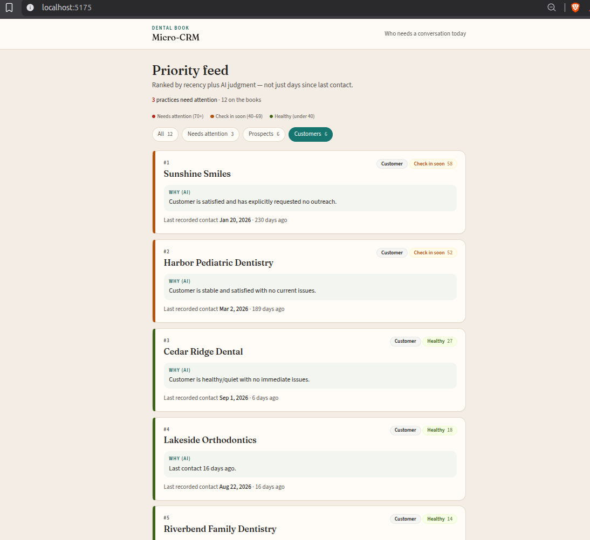
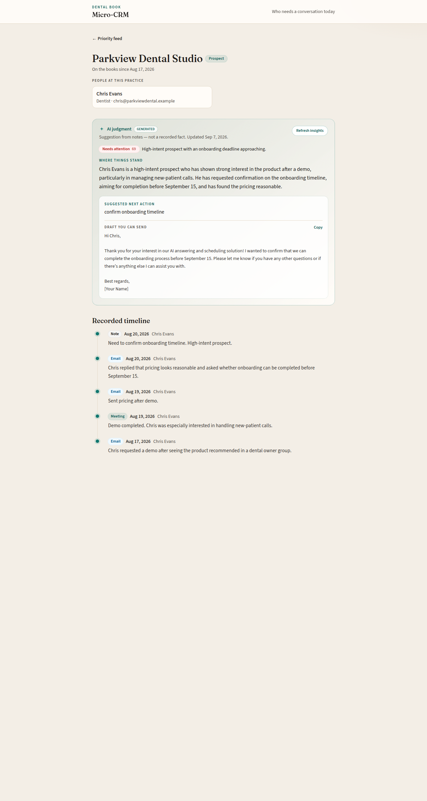

# AI-Powered Micro-CRM

A two-screen CRM for a small dental-industry supplier. It tracks practices, people, and conversations, then ranks **who needs a conversation today — and why**.

Priority is not “days since last contact.” Recency is one signal. The other is AI reading the interaction notes: a satisfied customer who has been quiet for months stays low urgency; a prospect who went cold after a proposal does not.

| Screen | Route | What you see |
|---|---|---|
| Priority feed | `/` | Ranked cards: status, urgency badge, AI one-liner, last contact |
| Practice detail | `/customers/:id` | Contacts, AI summary + next action + draft, recorded timeline |

The UI is **read-only**. Data comes from seeded CSVs (12 dental practices with staged stories).

**Developer docs:** [docs/ARCHITECTURE.md](docs/ARCHITECTURE.md) (class + sequence diagrams), [docs/SYSTEM_DESIGN.md](docs/SYSTEM_DESIGN.md) (original design), [docs/BUILD_PLAN.md](docs/BUILD_PLAN.md) (build plan).

---

## Screenshots

Priority feed — ranked cards, AI “why”, last recorded contact, and filters:



Practice detail — AI summary, suggested next action, copyable draft, and recorded timeline:



---

## Stack

- **Frontend:** React 19, Vite, TypeScript, Tailwind, React Router
- **Backend:** FastAPI, SQLAlchemy 2, Alembic, Pydantic
- **Database:** MySQL 8 (Docker, host port **3307**)
- **AI:** OpenAI-compatible chat completions (`gpt-4o-mini`). Official OpenAI keys or OpenRouter (`sk-or-…`) via `OPENAI_BASE_URL`

Layering: **Router → Service → Repository → MySQL**. The OpenAI SDK is imported only in [`backend/app/services/ai_service.py`](backend/app/services/ai_service.py).

---

## Quick start

You need Docker, Python 3.11+, and Node 20+.

```bash
# 1. MySQL
docker compose up -d

# 2. Env
cp .env.example .env
# Set OPENAI_API_KEY. OpenRouter keys (sk-or-…) work; leave OPENAI_BASE_URL
# as https://openrouter.ai/api/v1 or omit it — sk-or- keys are auto-detected.

# 3. Backend (from repo root, new terminal)
cd backend
python -m venv .venv
source .venv/bin/activate
pip install -e .
alembic upgrade head
python -m app.seed.seed_data
uvicorn app.main:app --reload --port 8001

# 4. Frontend (another terminal, from repo root)
cd frontend
npm install
npm run dev
```

- App: [http://127.0.0.1:5173](http://127.0.0.1:5173)
- API: [http://127.0.0.1:8001](http://127.0.0.1:8001) — `GET /health`, OpenAPI at `/docs`
- Vite proxies `/api` → `http://127.0.0.1:8001`

Ports **3307** and **8001** avoid colliding with a local MySQL on 3306 or another API on 8000.

**Database dump:** [db/microcrm.sql](db/microcrm.sql) is a full MySQL dump (schema + seed + cached insights). Restore with `docker exec -i microcrm-mysql mysql -uroot -ppassword < db/microcrm.sql` — see [db/README.md](db/README.md). After a restore you can skip Alembic and the seed script.

Without a working key the app still runs: the feed uses recency-only scores (quiet accounts can look urgent). After you add a key, reload the dashboard (placeholder scores are regenerated) and click **Refresh insights** on a practice for a real summary.

Reseed: `FORCE_SEED=1 python -m app.seed.seed_data` from `backend/`.

---

## How to use it

1. Open the feed. Highest urgency is at the top (`#1`, `#2`, …).
2. Filter: All / Needs attention (score ≥ 70) / Prospects / Customers.
3. Open a card. The teal panel is **AI** (summary, next action, optional draft + Copy). The timeline below is **recorded interactions**.
4. Click **Refresh insights** to call the model again for that practice.

Useful contrasts in the seed data:

- **BrightSmile Dental** / **Summit Implant Studio** — went cold after a proposal or intro (should rank high)
- **Harbor Pediatric** / **Sunshine Smiles** — happy and quiet (should rank low once AI has run)

---

## How AI is used

Three JSON prompts, all over the interaction notes:

| Job | When | Output |
|---|---|---|
| Priority | Feed load if no real score yet; also on refresh | `{ score, reason }` 0–100 |
| Summary | Detail / refresh | 2–3 sentences |
| Next action | Detail / refresh | Action + optional drafted message |

**Combined score:** `round(0.4 * recency + 0.6 * ai)` where recency maps “days since last contact” onto 0–100 (capped at 90 days).

Results are stored one row per customer in `ai_insights`. The feed does not re-call the model if a score already exists (unless it is still the “No AI score yet” fallback). **Refresh insights** is the only manual re-generation.

---

## API

| Method | Route | Purpose |
|---|---|---|
| GET | `/health` | Liveness |
| GET | `/api/customers` | Paginated list. Query: `filter`, `limit` (1–100, default 20), `offset`. Returns `{ items, total, has_more, counts }` |
| GET | `/api/customers/{id}` | Contacts + timeline |
| GET | `/api/customers/{id}/insights` | Cached or generated summary / action |
| POST | `/api/customers/{id}/insights/refresh` | Force regenerate |
| GET | `/api/interactions?customer_id=` | Paginated timeline. Query: `limit` (default 50), `offset` |

---

## Repository map

```
CRM-app/
├── docker-compose.yml      # MySQL 8 only
├── .env.example
├── db/microcrm.sql         # MySQL dump (schema + data)
├── docs/                   # architecture, design, build plan
├── backend/app/
│   ├── main.py             # FastAPI + CORS
│   ├── models/             # SQLAlchemy
│   ├── repositories/       # DB access
│   ├── services/           # CustomerService, PriorityService, AIService
│   ├── routers/            # HTTP
│   └── seed/data/          # CSVs
└── frontend/src/
    ├── pages/              # Dashboard, CustomerDetail
    ├── components/         # cards, badges, AI panel, timeline
    └── api/client.ts
```

---

## Design decisions

- **AI is isolated.** Swap OpenAI / OpenRouter / a mock by changing `AIService`.
- **Cache in MySQL.** Cost and latency stay off the hot path after the first generation.
- **Recency + judgment.** That blend is the product, not a chat box.
- **Two screens.** Depth over a generic CRM feature list.

## Out of scope

- Auth / multi-user
- Create or edit records in the UI
- Notifications or reminders
- A generic AI chat

## What’s next

- Save a sent draft as a note
- Batch insight generation as a background job
- Light search and status changes
