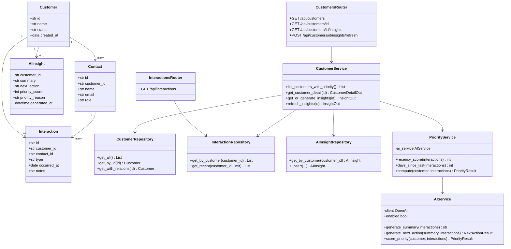
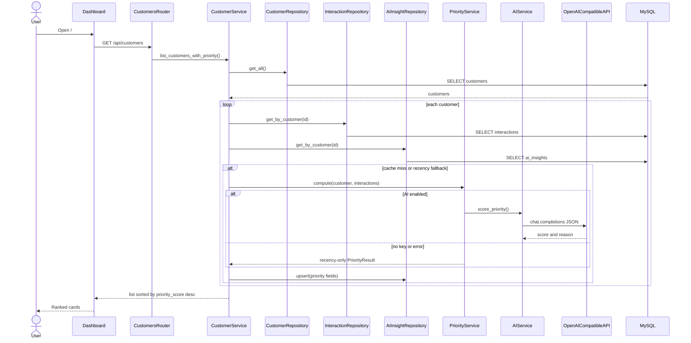
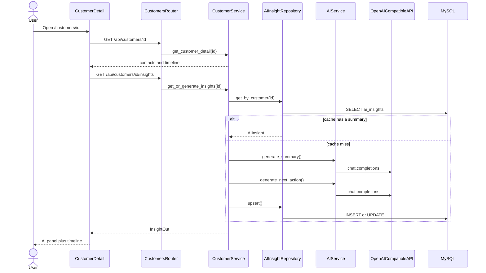
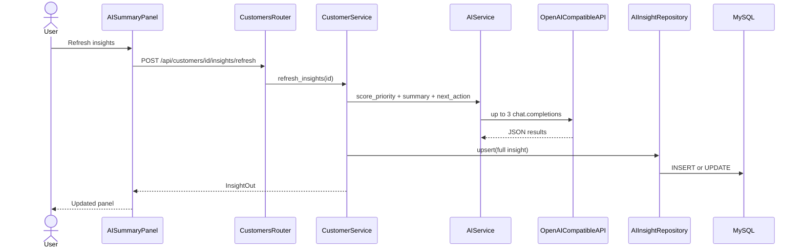

# Architecture (as built)

This is the developer map of the running system. Original intent lives in [SYSTEM_DESIGN.md](SYSTEM_DESIGN.md) and [BUILD_PLAN.md](BUILD_PLAN.md). Where they differ (Anthropic vs OpenAI-compatible, port numbers), **this file wins**.

```
Browser  →  Vite (5173, proxies /api)  →  FastAPI (8001)  →  MySQL (3307)
                                              └── AIService → OpenAI-compatible API
```

**Layering:** `Router → Service → Repository → SQLAlchemy model → MySQL`.

---

## 1. Class diagram



| Module | Path |
|---|---|
| Models | `backend/app/models/` |
| Repositories | `backend/app/repositories/` |
| CustomerService | `backend/app/services/customer_service.py` |
| PriorityService | `backend/app/services/priority_service.py` |
| AIService | `backend/app/services/ai_service.py` |
| Routers | `backend/app/routers/customers.py`, `interactions.py` |

`PriorityService.compute()`: `score = round(0.4 * recency + 0.6 * ai)`. Recency is days since last interaction scaled to 0–100 (90 days = 100). If the model is off or errors, the feed still returns recency-only scores.

`AIService` is the only place that constructs the OpenAI client. `sk-or-` keys use `https://openrouter.ai/api/v1` unless `OPENAI_BASE_URL` is set.

---

## 2. Data model

```mermaid
erDiagram
    CUSTOMERS ||--o{ CONTACTS : has
    CUSTOMERS ||--o{ INTERACTIONS : has
    CONTACTS ||--o{ INTERACTIONS : participates_in
    CUSTOMERS ||--o| AI_INSIGHTS : caches

    CUSTOMERS {
        varchar id PK
        varchar name
        enum status
        date created_at
    }
    CONTACTS {
        varchar id PK
        varchar customer_id FK
        varchar name
        varchar email
        varchar role
    }
    INTERACTIONS {
        varchar id PK
        varchar customer_id FK
        varchar contact_id FK
        enum type
        date occurred_at
        text notes
    }
    AI_INSIGHTS {
        varchar customer_id PK_FK
        text summary
        text next_action
        int priority_score
        text priority_reason
        datetime generated_at
    }
```

`INTERACTIONS.notes` is what the model reads. `AI_INSIGHTS` is a cache (one row per customer), not a source of truth. Index: `interactions(customer_id, occurred_at)`.

Alembic: `backend/alembic/versions/001_initial_schema.py`. Seed: `backend/app/seed/data/*.csv`.

---

## 3. Sequence diagrams

### 3.1 Dashboard load



### 3.2 Customer detail (summary + next action)



### 3.3 Manual refresh



---

## 4. Frontend structure

```
App
├── Dashboard (/)
│   ├── attention count + color legend
│   ├── PriorityFilterBar
│   └── CustomerCard[]   (rank, status, priority, Why AI, last contact)
└── CustomerDetail (/customers/:id)
    ├── CustomerHeader   (name, status, contact cards)
    ├── AISummaryPanel   (summary, next action, copy draft, refresh)
    └── InteractionTimeline
```

| File | Role |
|---|---|
| `frontend/src/pages/Dashboard.tsx` | Fetch list, filters, counts |
| `frontend/src/pages/CustomerDetail.tsx` | Fetch detail + insights |
| `frontend/src/components/CustomerCard.tsx` | Display only |
| `frontend/src/components/AISummaryPanel.tsx` | AI UI + refresh |
| `frontend/src/components/InteractionTimeline.tsx` | Recorded events |
| `frontend/src/api/client.ts` | Typed `fetch` to `/api` |

---

## 5. Runtime

| Process | How | Port |
|---|---|---|
| MySQL | `docker compose up -d` | 3307 → 3306 in the container |
| FastAPI | `uvicorn app.main:app --reload --port 8001` | 8001 |
| Vite | `npm run dev` | 5173, proxy `/api` → 8001 |

Config is loaded from the repo-root `.env` (`backend/app/config.py`). Copy `.env.example` and set `OPENAI_API_KEY`.

---

## 6. Indexes and pagination

Indexes (Alembic `002_scale_indexes`):

| Index | Why |
|---|---|
| `customers(status)` | Prospect / customer filters |
| `customers(name)` | Stable sort tie-break |
| `ai_insights(priority_score)` | Order by urgency, “needs attention” count |
| `interactions(customer_id, occurred_at)` | Timeline + last-contact subquery |
| `interactions(contact_id)` | FK lookups |
| `contacts(email)` | Future search |

`GET /api/customers` is paginated (`limit` default 20, max 100, `offset`, `filter`). The feed with 12 practices still fits on one page — **Load more** only appears when `has_more` is true. Filter counts come from SQL aggregates, not the current page.

`GET /api/interactions` is paginated the same way (`limit` default 50). Detail still returns the full timeline for a single practice (typical volume is small).

