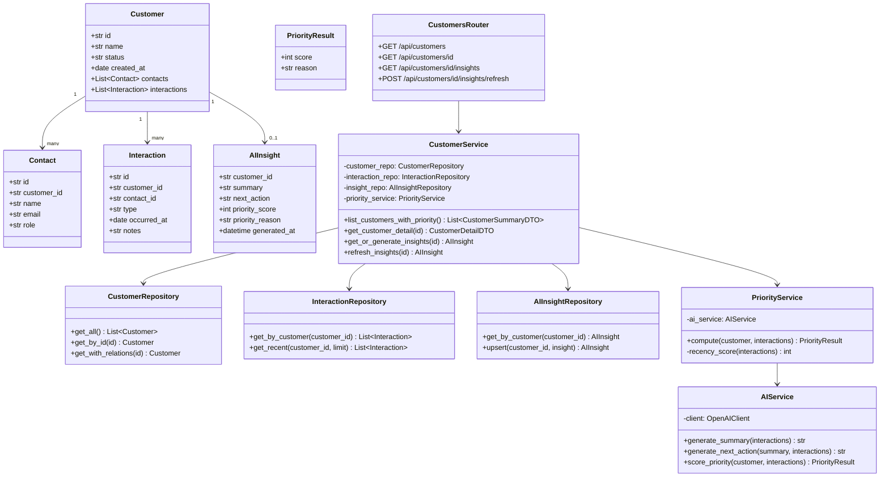
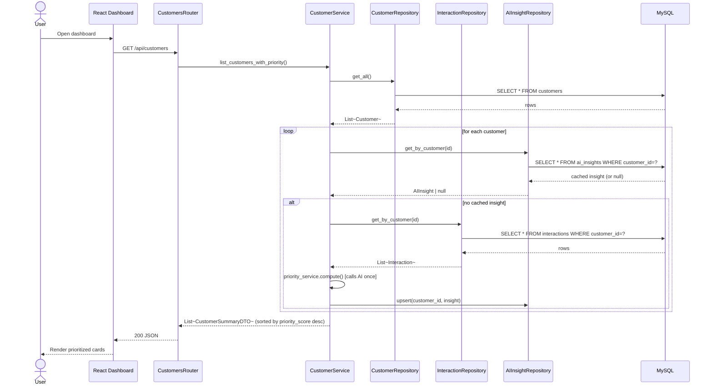
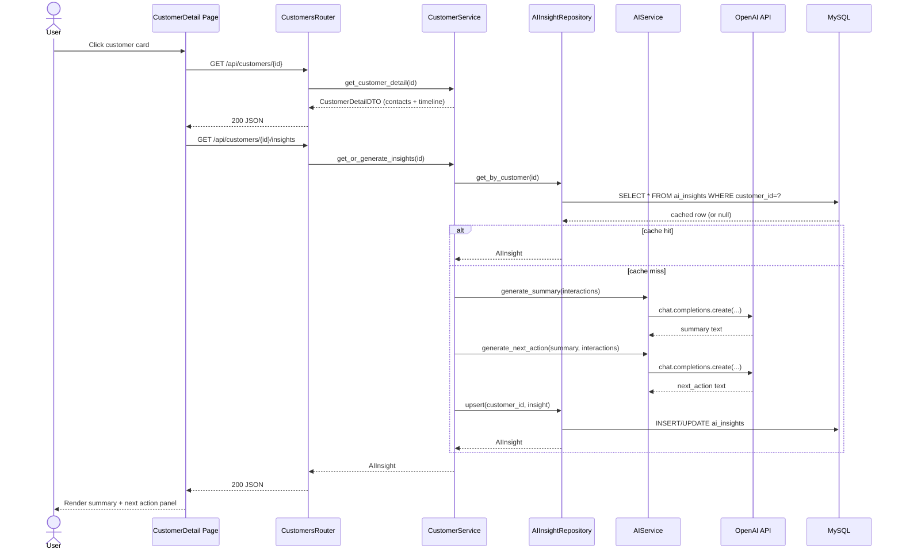
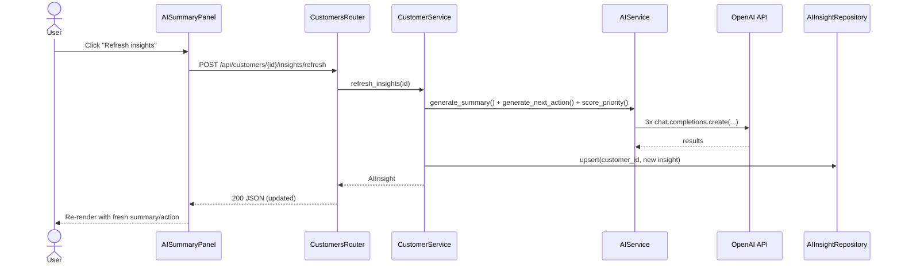

# AI-Powered Micro-CRM — System Design

Companion to [BUILD_PLAN.md](BUILD_PLAN.md). Original design: ERD, backend classes, sequences, frontend.

**As built:** see [ARCHITECTURE.md](ARCHITECTURE.md) — class diagram, sequences, and file map matching the code. Differences from this draft: OpenAI-compatible SDK (OpenAI or OpenRouter), MySQL on host **3307**, API on **8001**, insights live on the customers router (no separate `ai.py`).

> **AI provider:** `ai_service.py` wraps the OpenAI SDK (`gpt-4o-mini`). OpenRouter keys (`sk-or-…`) work via `OPENAI_BASE_URL` / auto-detect. Everything else is provider-agnostic.

---

## 1. Database Architecture (ERD)

```mermaid
erDiagram
    CUSTOMERS ||--o{ CONTACTS : has
    CUSTOMERS ||--o{ INTERACTIONS : has
    CONTACTS ||--o{ INTERACTIONS : participates_in
    CUSTOMERS ||--o| AI_INSIGHTS : has

    CUSTOMERS {
        varchar id PK
        varchar name
        enum status "prospect | customer"
        date created_at
    }

    CONTACTS {
        varchar id PK
        varchar customer_id FK
        varchar name
        varchar email
        varchar role
    }

    INTERACTIONS {
        varchar id PK
        varchar customer_id FK
        varchar contact_id FK
        enum type "email | call | meeting | note"
        date occurred_at
        text notes
    }

    AI_INSIGHTS {
        varchar customer_id PK_FK
        text summary
        text next_action
        int priority_score
        text priority_reason
        datetime generated_at
    }
```

**Design notes:**
- `AI_INSIGHTS` is a cache table, one row per customer, regenerated on demand — keeps AI calls off the hot path of every page load.
- `INTERACTIONS.notes` is the richest field — it's the raw input the AI service reads to generate summaries/priority. Treat it as the "source of truth" the AI reasons over.
- Indexes worth adding: `interactions(customer_id, occurred_at DESC)` since the dashboard and timeline both query "most recent interaction per customer."

---

## 2. Backend Class Diagram



**Layering:** `Router → Service → Repository → DB Model`. Keep AI calls isolated inside `AIService` so it's the only class that knows about the OpenAI SDK — makes it trivial to swap providers or mock in tests.

---

## 3. Sequence Diagrams

### 3.1 Dashboard load (prioritized customer list)



### 3.2 Customer detail view (AI summary + next action)



### 3.3 Manual insight refresh



---

## 4. Frontend Design

### 4.1 Page structure

```
App
├── Dashboard (/)
│   ├── PriorityFilterBar        (all / needs attention / prospects / customers)
│   ├── CustomerCard[]
│   │   ├── StatusBadge          (prospect / customer)
│   │   ├── PriorityBadge        (color-coded: red/amber/green)
│   │   └── "why" one-liner      (AI priority_reason)
│   └── LoadingSkeleton
│
└── CustomerDetail (/customers/:id)
    ├── CustomerHeader           (name, status, contacts list)
    ├── AISummaryPanel
    │   ├── Summary text
    │   ├── SuggestedNextAction  (with "copy" button for drafted message)
    │   └── RefreshButton
    └── InteractionTimeline
        └── TimelineItem[]        (icon per type: email/call/meeting/note)
```

### 4.2 Visual design direction

- **Layout:** Dashboard as a single-column priority feed (not a dense table) — reinforces "here's who needs your attention today," not "here's a spreadsheet."
- **Priority color coding:**
  - 🔴 Red — high urgency (e.g., stalled post-proposal, high-intent prospect gone quiet)
  - 🟡 Amber — worth a check-in soon
  - 🟢 Green — quiet but healthy (satisfied customer, no action needed)
- **Typography:** one clear heading font + one body font, generous whitespace — avoid a cluttered "enterprise CRM" feel since the audience is a small business owner, not a sales ops team.
- **AI content visually distinct:** give the summary/next-action panel a subtle accent background or icon (e.g., a small sparkle icon) so it reads as "AI-generated insight" vs. raw data — builds trust by being transparent about what's AI vs. what's fact from the DB.
- **Empty/loading states:** since AI calls add latency, show a skeleton loader on first insight generation, with cached (instant) loads afterward.

### 4.3 Component responsibility

| Component | Responsibility |
|---|---|
| `Dashboard.tsx` | Fetch `/api/customers`, hold filter state, render list |
| `CustomerCard.tsx` | Pure display: name, status, priority badge, reason — no logic |
| `CustomerDetail.tsx` | Fetch detail + insights, orchestrate child components |
| `AISummaryPanel.tsx` | Display summary/next-action, handle refresh button + loading state |
| `InteractionTimeline.tsx` | Render sorted interaction list with type icons |
| `api/client.ts` | Single fetch wrapper — base URL, error handling, typed responses |

---

## 5. How These Pieces Fit the Assignment's Evaluation Criteria

- **Where AI adds value** is explicit and isolated (`AIService`) — easy to point to in your README as a deliberate architectural choice, not AI sprinkled everywhere.
- **Priority logic** combines a computed signal (recency) with an AI-reasoned signal (context-aware urgency) — this is the "smart" part worth highlighting.
- **Caching (`ai_insights` table)** shows awareness of cost/latency tradeoffs, which is a strong signal in a take-home for an AI product role.
